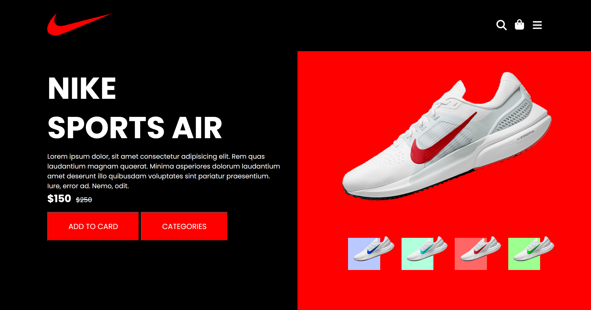
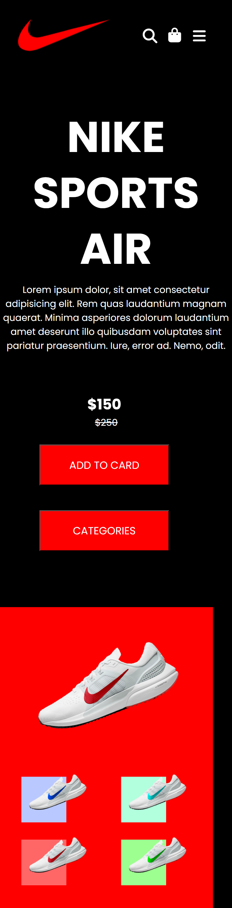
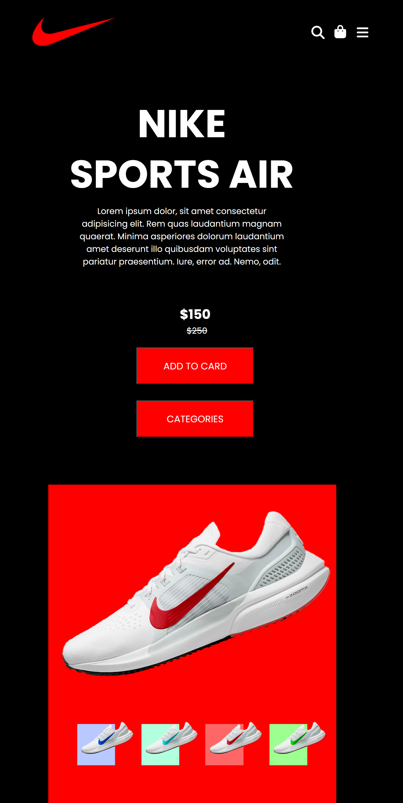

# Nike Landing Page 👟

This project is a responsive landing page design created for the Nike brand using HTML and CSS. It serves as a frontend practice project with a clean layout, modern design, and mobile-friendly structure.

## 🖥️ Live Demo

🔗 View Site:(https://bariskarakocdev.github.io/nike-landing-page/)

## 💻 Technologies Used

- HTML5
- CSS3
- Flexbox & Grid Layouts
- Responsive Media Queries

## 📱 Responsive Tasarım Görselleri

### 🖥️ Masaüstü Görünüm

### 📱 Mobil Görünüm

### 📲 Tablet Görünüm

## 📁 Project Structure

nike-landing-page/
├── index.html
├── style.css
├── images/
├── LICENSE
└── README.md

## 📝 License

This project is licensed under the terms of the [MIT License](./LICENSE).

## ✍️ Developer

- [@bariskarakocdev](https://github.com/bariskarakocdev)

